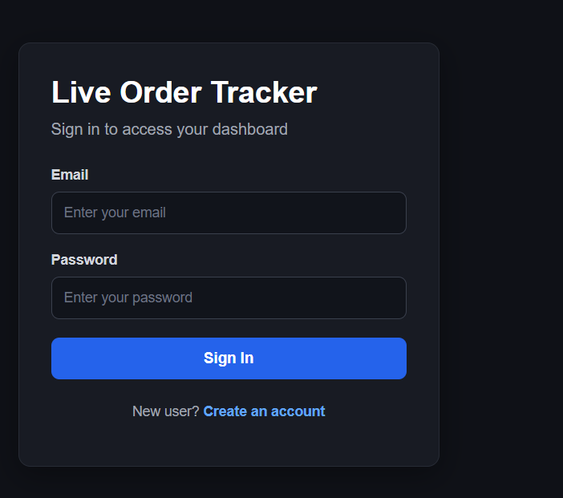
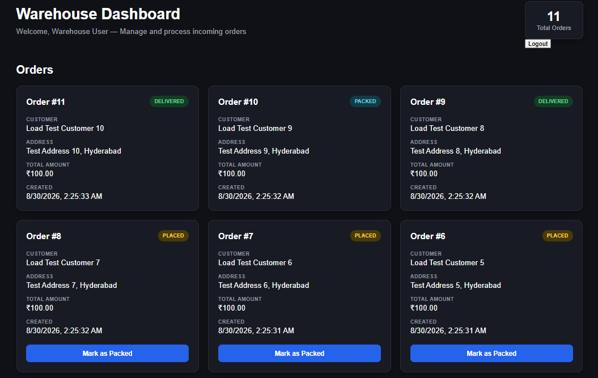
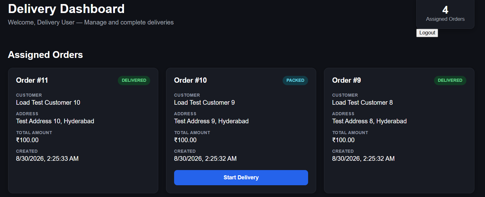
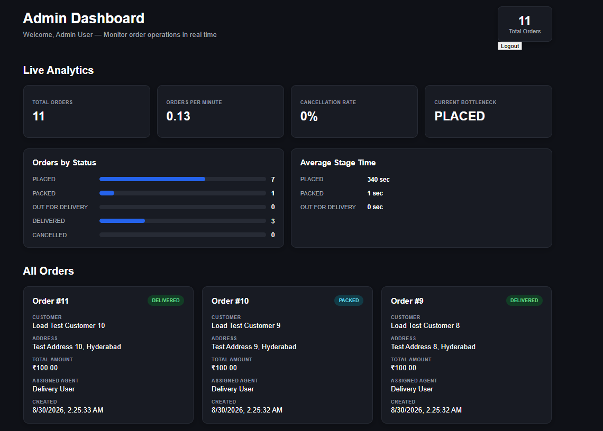

# 🚚 OrderPulse — Live Order & Delivery Tracker

A real-time, full-stack order operations platform that allows multiple teams to track and manage orders through their complete delivery lifecycle.

The application supports **Warehouse, Delivery, and Admin roles**, with role-based dashboards and live updates powered by **Socket.io**.

🔗 **Live Demo:** https://orderpulse-1-d74n.onrender.com  
💻 **GitHub Repository:** https://github.com/Pruthvirajsg123/orderpulse

---

## ✨ Features

### 🔐 Authentication & Role-Based Access

- User registration and login
- JWT-based authentication
- Role-based authorization
- Protected frontend routes
- Separate dashboards for:
  - 📦 Warehouse
  - 🚚 Delivery
  - 📊 Admin

### 📦 Order Management

- Create and track orders
- Assign orders to delivery agents
- Update order status throughout the delivery lifecycle

**Order flow:**

```text
PLACED → PACKED → OUT_FOR_DELIVERY → DELIVERED

Orders can also be cancelled when required.

⚡ Real-Time Updates

Real-time order updates using Socket.io
Role-based Socket.io rooms
Personal user rooms for targeted updates
Live synchronization across multiple dashboards

When an order status changes, the relevant dashboards update without requiring a page refresh.

📊 Live Analytics Dashboard

The Admin dashboard provides real-time operational insights including:

Total orders
Orders grouped by status
Orders per minute
Cancellation rate
Average stage time
Current operational bottleneck

🧪 Load Testing / Order Simulation

A separate load-test script can simulate incoming orders against the API.

This helps demonstrate:

Backend API reliability
Database persistence
Real-time event propagation
Dashboard synchronization


🏗️ Architecture
                    ┌─────────────────────┐
                    │   React Frontend    │
                    │                     │
                    │ Warehouse Dashboard │
                    │ Delivery Dashboard  │
                    │ Admin Dashboard     │
                    └──────────┬──────────┘
                               │
                   REST API + Socket.io
                               │
                    ┌──────────▼──────────┐
                    │ Node.js + Express   │
                    │      Backend        │
                    │                     │
                    │ JWT Authentication  │
                    │ Role Authorization  │
                    │ Socket.io Server    │
                    └──────────┬──────────┘
                               │
                         PostgreSQL
                               │
                    ┌──────────▼──────────┐
                    │     Supabase DB     │
                    └─────────────────────┘


🛠️ Tech Stack
Frontend
React
React Router
Socket.io Client
Vite
Backend
Node.js
Express.js
Socket.io
JWT Authentication
bcrypt
Database
PostgreSQL
Supabase
Deployment
Render
Supabase PostgreSQL


📁 Project Structure
orderpulse/
│
├── client/              # React frontend
│   └── src/
│       ├── context/     # Authentication context
│       ├── pages/       # Role-based dashboards
│       └── ...
│
├── server/              # Node.js backend
│   └── src/
│       ├── controllers/
│       ├── middleware/
│       ├── routes/
│       ├── socket/
│       └── server.js
│
├── load-test/           # Order simulation script
│
└── README.md


🚀 Running the Project Locally

1. Clone the Repository
git clone https://github.com/Pruthvirajsg123/orderpulse.git
cd orderpulse
2. Start the Backend
cd server
npm install

Create a .env file inside the server folder:

PORT=5000
DATABASE_URL=your_postgresql_connection_string
JWT_SECRET=your_jwt_secret
CLIENT_URL=http://localhost:5173

Start the server:

npm start

The backend will run on:

http://localhost:5000

You can verify it using:

http://localhost:5000/api/health
3. Start the Frontend

Open another terminal:

cd client
npm install

Create a .env file inside the client folder:

VITE_API_URL=http://localhost:5000

Start the frontend:

npm run dev

The application will usually be available at:

http://localhost:5173

🔐 Environment Variables
Server

Create:

server/.env

Example:

PORT=5000
DATABASE_URL=
JWT_SECRET=
CLIENT_URL=http://localhost:5173
Client

Create:

client/.env

Example:

VITE_API_URL=http://localhost:5000

Never commit .env files containing real credentials or secrets.

🧪 Running the Load Test

The project includes a script for simulating incoming orders.

Navigate to the load-test directory:

cd load-test

Configure the API URL and test credentials in the load-test environment configuration.

Then run:

node generateOrders.js

The script will:

Authenticate with the backend
Obtain a JWT token
Generate multiple simulated orders
Send them to the API
Display success/failure statistics

You can observe the orders appearing in real time across the dashboards.


🔄 Real-Time Flow
Order Created
      │
      ▼
Express API
      │
      ▼
PostgreSQL Database
      │
      ▼
Socket.io Event
      │
      ├──────────────► Warehouse Dashboard
      │
      ├──────────────► Delivery Dashboard
      │
      └──────────────► Admin Dashboard

The application uses Socket.io rooms to ensure that relevant real-time events are delivered to the appropriate users and roles.

## 📸 Screenshots

### 🔐 Register / Login



### 📦 Warehouse Dashboard



### 🚚 Delivery Dashboard



### 📊 Admin Dashboard



🎯 What I Learned

While building OrderPulse, I gained hands-on experience with:

Designing REST APIs
JWT authentication and authorization
Role-based access control
PostgreSQL database integration
Real-time communication with Socket.io
React Context for authentication state
Frontend route protection
Cloud deployment with Render
Managing production and local environment configuration

🔮 Future Improvements
Order filtering and search
Pagination for large order volumes
Advanced analytics and charts
Email or push notifications
Improved load testing with concurrent users
Automated testing and CI/CD


👨‍💻 Author

Pruthviraj

GitHub: https://github.com/Pruthvirajsg123
```
